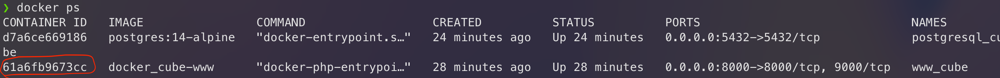

# Projet CUBE 1 - Backend
Pour exécuter le backend il est conseiller de le faire avec Docker afin que tout le monde est les mêmes dépendances ainsi que le même environnement de développement.

>Pour installer Docker veuillez vous référer aux documentations de [Docker](https://docs.docker.com/get-docker/) et [docker-compose](https://docs.docker.com/compose/install/)( si vous êtes sur Mac, Docker a directement installé docker-compose, il n'est donc pas nécessaire de l'installer à nouveau

## Lancer le projet par script avec la commande suivante : 
```properties
> ./start_container.sh
```

## Lancer l'environnement de développement
Lancer docker et dans le terminal, à la racine du projet, tapez:
```properties
> docker-compose up -d
```
Ainsi Docker va télécharger, construire et exécuter nos containeurs


Et voilà notre backend ainsi que notre base de données sont lancer ! Pour le vérifier vous pouvez vous rendre à l'adresse suivante: [127.0.0.1:8000](127.0.0.1:8000)

> ### *⚠️ Si vous venez de cloner le projet il est nécessaire d'installer les dépendances de celui-ci et d'initialiser JWT ⚠️*
>
> Pour faire cela il faut nous rendre à l'intérieur de notre container (www_cube). Ensuite tapez les commandes suivantes :
> ```properties
> // Installation des dépendances
>> composer install
>> symfony console doctrine:migrations:migrate
>> symfony console doctrine:fixtures:load
>```
> ```properties
> // Initialisation de JWT
> symfony console lexik:jwt:generate-keypair
> ```


## Rentrer dans un container

La plupart du temps nous devront exécuter nos commandes dans le container _cube-www_ et pas directement sur notre machine. 

Pour ce faire nous devons déjà identifier le container :
```properties
> docker ps
```
Ici, ce qui nous intéresse c'est l'ID de notre container _docker\_cube-www_. Copiez-le


Ensuite, pour ouvrir le bash de notre container il suffit de taper le commande suivante :

```properties
> docker exec -ti ID_DE_NOTRE_CONTAINER bash
```
